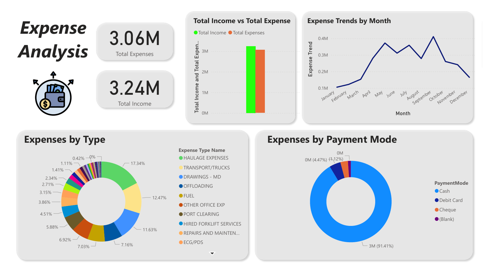

<h1>Expense Analysis</h1> 
<h3>Personal Project Practice!</h3> 

My first Power BI practice project using Microsoft Power BI to analysis the expenses dataset
 
<h2>Key Features:</h2>

You can see Total Expense, Total Income, Total Income vs Total Expense, Expense Trends by Month, Expenses by Type, Expenses by Payment Mode  

dataset from: https://www.youtube.com/watch?v=rux1ZY0TyD4&list=WL&index=1&t=1348s 
 
